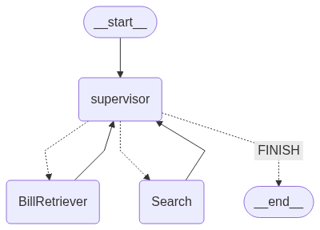
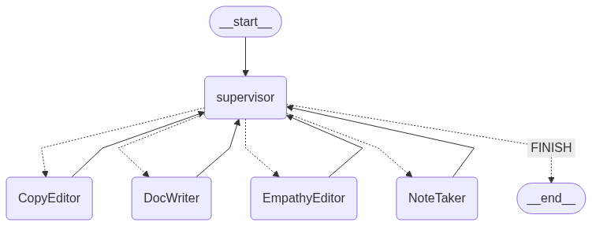

# Multi-Agent RAG Workflow with LangGraph

This notebook demonstrates how to build a multi-agent workflow for Retrieval-Augmented Generation (RAG) using [LangGraph](https://langchain-ai.github.io/langgraph/), LangChain Expression Language (LCEL), and various agent tools.

## Overview

- **Multi-Agent Teams:** Implements a system where multiple agents (each with their own specialty) collaborate using a supervisor agent to route tasks.
- **Retrieval-Augmented Generation (RAG):** Combines document retrieval and LLM-powered answer generation.
- **LangGraph:** Used to build modular, stateful workflows that combine agents and tools as nodes in a graph.

---

### Supervisor Agent Role in the Workflow Diagrams

#### 
In `my_1st_graph.png`, the supervisor agent acts as the central coordinator. It receives user queries and determines which specialized agent (e.g., document retriever, web search agent, or answer generator) is most suited for the task. The supervisor routes the query to the appropriate agent, collects the results, and then returns a unified response to the user. This ensures clear task delegation and efficient execution for simple or linear workflows.

#### 
In `my_graph.png`, the supervisor agent’s role is expanded for more complex workflows. Here, the supervisor not only routes between multiple specialized agents but also manages multi-step reasoning and collaboration. It can sequence tasks, combine outputs from different agents, and even trigger agents based on intermediate results. This allows for sophisticated multi-agent collaboration, dynamic branching, and robust handling of complex research or synthesis tasks.

---

## Features

- Loads and processes PDF documents (AI-related bills in the Philippines).
- Splits documents into manageable chunks and creates vector embeddings using OpenAI's embedding models.
- Uses [Qdrant](https://qdrant.tech/) as an in-memory vector store for efficient retrieval.
- Integrates OpenAI's GPT models for answer generation.
- Adds external tools such as Tavily web search for up-to-date information.
- Provides helper functions for creating agent nodes, agent executors, and supervisor routers.
- Demonstrates chaining and composition of agents using LangGraph.

## Structure

- **Dependencies:** Requires API keys for OpenAI and Tavily, and optionally LangSmith for tracing.
- **Document Processing:** Loads and splits PDFs, creates embeddings, and stores them in Qdrant.
- **RAG Pipeline:** Combines retrieval, augmentation (prompting), and generation in a single graph.
- **Tools:** Defines custom retrieval functions and integrates Tavily search as agent tools.
- **Helpers:** Utility functions for agent creation and routing.
- **Research Team Example:** Shows how to assemble agents and a supervisor for collaborative research tasks.

## How to Run

1. **Install dependencies:**
   - `langchain`, `langgraph`, `langchain_openai`, `qdrant-client`, `tiktoken`, and other required Python packages.
2. **Set up API keys:**
   - OpenAI API Key, Tavily API Key (see instructions in notebook).
3. **Prepare data:**
   - Place relevant PDF documents in the `bills/` directory.
4. **Run the notebook:**
   - Step through each cell for document loading, chunking, embedding, vector storage, and agent workflow setup.

## References

- [LangGraph Documentation](https://langchain-ai.github.io/langgraph/)
- [AutoGen Paper](https://arxiv.org/pdf/2308.08155)
- [LangChain Docs](https://python.langchain.com/)
- [Qdrant](https://qdrant.tech/)
- [Tavily](https://www.tavily.com/)

## License

This notebook is intended for educational purposes as part of the PSI AI Academy.

---

Feel free to modify, extend, and experiment with the workflow!
